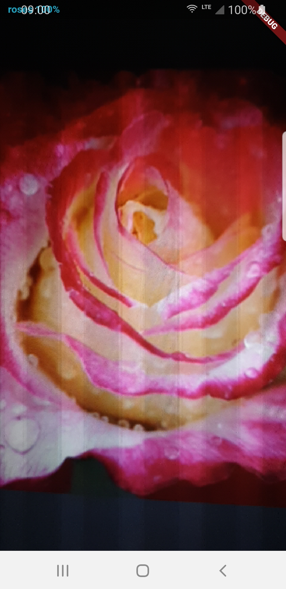

# Realtime flower detection

This app detects flowers in real time.

It is based on 
 - [https://github.com/shaqian/flutter_realtime_detection] for using tflite in flutter
 - [https://codelabs.developers.google.com/codelabs/tensorflow-for-poets/#0] for transfer learning
 - [https://github.com/tensorflow/models/blob/master/research/object_detection/g3doc/detection_model_zoo.md] for mobilenet 

## Goal

This project is used for protoyping
 - Flutter
 - inference of machine learning model on the devivce
 - transfer learning
 - object detection
 - google colab
 
## Screenshots

Main Screen

  

Detection Screen

  

